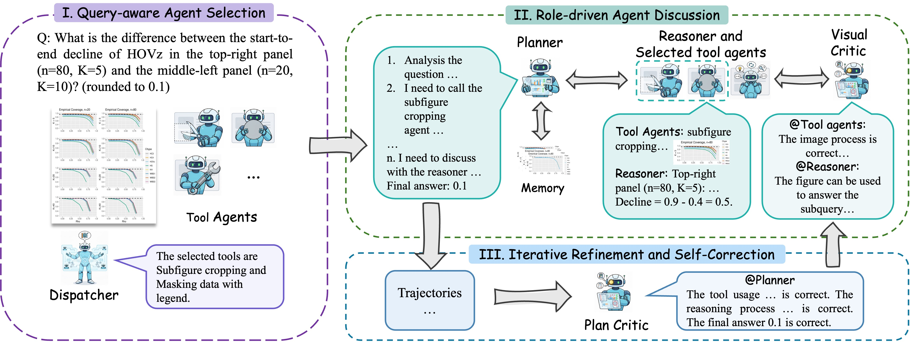

# PixelCraft: A Multi-Agent System for High-Fidelity Visual Reasoning on Structured Images

<a href='https://arxiv.org/abs/2509.25185'></a> 
<a href='https://huggingface.co/zss01/PixelCraft-3B'></a>


---

## 📌 Overview

**PixelCraft** is a novel multi-agent system designed to enable **high-fidelity visual reasoning** on **structured images** such as charts, scientific plots, and geometric diagrams. Unlike existing multimodal large language models (MLLMs) that often suffer from perceptual errors and rigid linear reasoning, PixelCraft introduces a **dynamic, collaborative agent framework** that integrates precise image processing with flexible, non-linear reasoning strategies.

By combining pixel-level grounding with classical computer vision tools and multi-agent collaboration, PixelCraft brings notable gains in structured image understanding.

---

## 🚀 Key Features

* **🔍 High-Fidelity Image Processing:**
  Fine-tuned MLLM with pixel-level grounding provides precise localization of visual elements, enabling accurate data extraction and visual manipulation.

* **🧠 Multi-Agent Collaboration:**
  A planner, reasoner, critics, and visual tool agents work together in a three-stage workflow — **query-aware tool selection**, **role-driven reasoning**, and **iterative self-correction**.

* **📊 Image Memory & Non-Linear Reasoning:**
  A novel image memory mechanism allows agents to **revisit intermediate visual states**, **branch reasoning paths**, and **refine conclusions**, overcoming the limitations of linear chain-of-thought approaches.

* **🔧 Specialized Visual Tools:**
  PixelCraft introduces a rich suite of visual tool agents for tasks like subfigure cropping, region magnification, legend masking, auxiliary line drawing, and geometric construction.

---

## 📈 Performance Highlights

PixelCraft achieves substantially higher performance in structured visual reasoning across multiple challenging datasets:

| Benchmark      | GPT-4o | GPT-4.1-mini | Claude 3.7 Sonnet |
| -------------- | ------ | ------------ | ----------------- |
| **ChartXiv**   | 55.2   | 68.1         | 73.9              |
| **ChartQAPro** | 58.83  | 65.56        | 69.82            |
| **EvoChart**   | 70.24  | 79.44        | 80.48            |

---

## 🧪 System Workflow

The PixelCraft pipeline follows a **three-stage collaborative workflow**, enabling precise tool usage and flexible reasoning.

<p align="center">
  
</p>

**Workflow Stages:**

1. **Query-Aware Agent Selection:** The dispatcher analyzes the query and selects only the most relevant visual tool agents.  
2. **Role-Driven Agent Discussion:** The planner coordinates reasoning among agents, manages intermediate results, and dynamically recalls visual memory.  
3. **Iterative Self-Correction:** Critics verify tool outputs and reasoning logic, enabling refined and more accurate answers.

---

## 🚀 Quick Start

### Installation

```bash
conda create -n pixelcraft python=3.11
conda activate pixelcraft
pip install -r requirements.txt
```

### Inference

```bash
vllm serve /path/to/grounding_model \
    --host 127.0.0.1 \
    --port 8000 \
    --seed 42 \
    --served-model-name GroundingModel
```

```bash
export BASE_URL="api_url"
export OPENAI_API_KEY="xxx"
exp_name=eval
run_id=01
model_name="gpt-4.1-mini-2025-04-14"

python -u src/core/processor.py \
    --data_path data/chartxiv_val.json \
    --data_dir_root ./ \
    --output_dir_root output/${exp_name} \
    --tool_selection_path data/charxiv_selection.json \
    --output_dir "${run_id}" \
    --model_name "${model_name}" \
    --max_concurrent 8
```


## 📚 Citation

If you find this work helpful in your research, please cite our paper:

```bibtex
@article{zhang2025pixelcraft,
  title={PixelCraft: A Multi-Agent System for High-Fidelity Visual Reasoning on Structured Images},
  author={Zhang, Shuoshuo and Li, Zijian and Zhang, Yizhen and Fu, Jingjing and Song, Lei and Bian, Jiang and Zhang, Jun and Yang, Yujiu and Wang, Rui},
  journal={arXiv preprint arXiv:2509.25185},
  year={2025}
}
```
